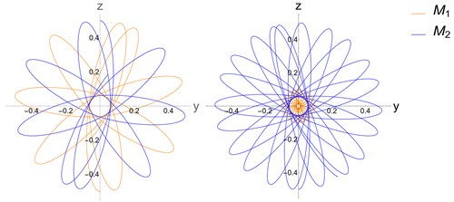



MSc thesis - Gertsenshtein Mechanism and its Potential Applications in Gravitational Waves Detection
------
Supervised by [Prof. Carlo Contaldi](https://profiles.imperial.ac.uk/c.contaldi). Available: [MSc thesis](../files/MScThesis.pdf). 30th May 2024 — 20th September 2024. Currenly working on turning this dissertation into a publication, aiming at Classical and Quantum Gravity. Draft avaliable for PhD applications upon request (comittee or potential supervisor).

BSc thesis - Fifth Force and Vainshtein Mechanism
------

Supervised by [Prof. Andrew Tolley](https://profiles.imperial.ac.uk/a.tolley), assessed by [Prof. Claudia de Rham](https://profiles.imperial.ac.uk/c.de-rham). Available: [BSc thesis](../files/BScThesis.pdf). 9th January 2023 — 24th March 2023.

Summer internship in Japan - Analytical Implementation of Generalized Gradient Approximation in Functional Renormalisation Group aided Density Functional Theory 
------

Supervised by [Dr. Haozhao Liang](https://tnp.phys.s.u-tokyo.ac.jp/en/members.html). Paper to be published soon. 1st June 2023 — 30th May 2024

LIP internship report - Measurement of B+ and B0 meson cross sections in pp collisions at the LHC
------

Supervised by [Prof. Nuno Leonardo](https://www.cienciavitae.pt/portal/en/BA1D-676F-76F5). Available: [LIP report](../files/LIPreport.pdf). 1st July 2022 — 30th September 2022.

